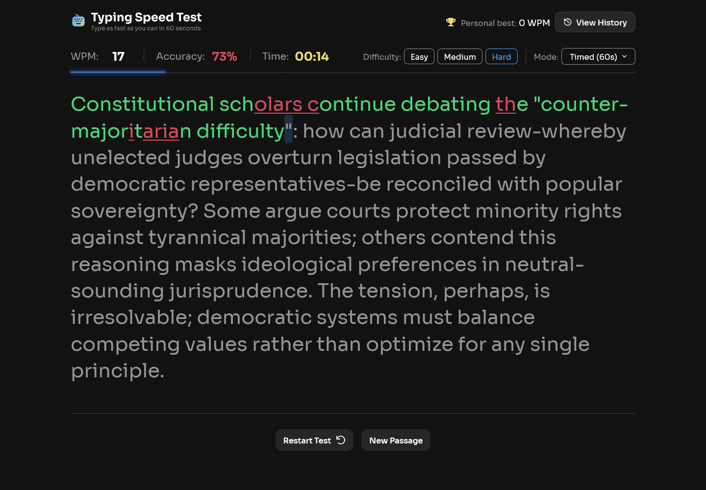
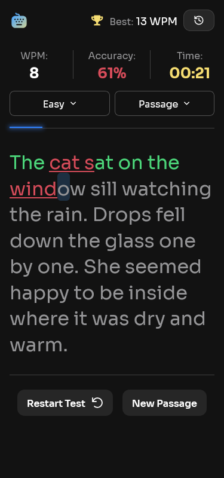
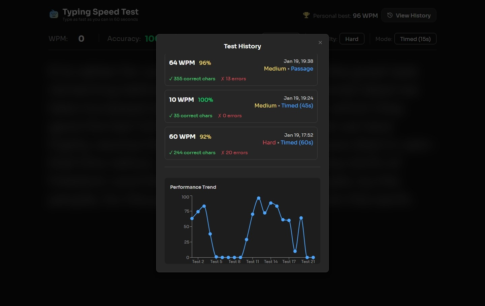
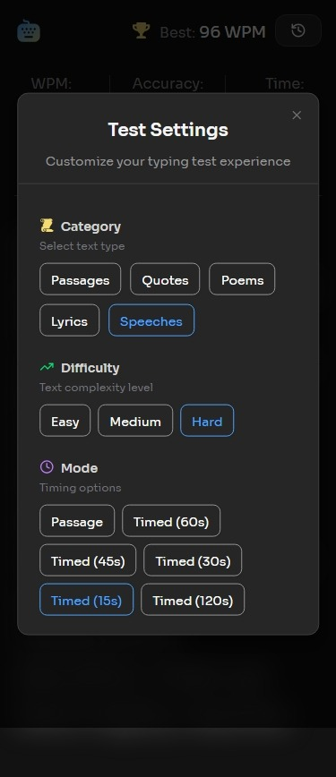

# Frontend Mentor - Typing Speed Test solution

This is a solution to the [Typing Speed Test challenge on Frontend Mentor](https://www.frontendmentor.io/challenges/typing-speed-test). Frontend Mentor challenges help you improve your coding skills by building realistic projects. 

## Table of contents

- [Overview](#overview)
  - [The challenge](#the-challenge)
  - [Screenshot](#screenshot)
  - [Links](#links)
- [My process](#my-process)
  - [Built with](#built-with)
  - [What I learned](#what-i-learned)
  - [Continued development](#continued-development)
- [Author](#author)

## Overview

### The challenge

Users should be able to:

- View the optimal layout for the interface depending on their device's screen size
- See hover and focus states for all interactive elements on the page

### Screenshots

#### Desktop

#### Mobile

#### Test History

#### Mobile Test Settings

### Links

- Solution URL: [https://github.com/Akiz-Ivanov/typing-speed-test](https://github.com/Akiz-Ivanov/typing-speed-test)
- Live Site URL: [https://typing-speed-test-iota-flame.vercel.app/](https://typing-speed-test-iota-flame.vercel.app/)

## My process

### Built With

- **React 19 + TypeScript** – type-safe components  
- **Zustand** – state management with `localStorage` persistence  
- **Tailwind CSS v4** – custom theming and utility-first styling  
- **shadcn/ui (Radix UI)** – accessible UI primitives  
- **Recharts** – performance and history charts  
- **date-fns** – date formatting & timezone handling  
- **Canvas Confetti** – personal best celebrations  
- **Framer Motion** – smooth UI animations  
- **Vite** – fast development and builds  
- **Mobile-first** responsive design

### What I learned

#### State management with Zustand

I learned how to:
- Structure stores with TypeScript
- Handle derived state
- Persist only important data

#### Real-time input handling

Challenges:
- Mobile keyboards don’t always fire onKeyDown
- Dash characters needed normalization
- Cursor had to stay locked at the end

#### Timer logic

I implemented:
- Count-down timers for timed modes
- Count-up timers for passage mode

#### Mobile UX

- Virtual keyboard behavior
- Scrolling inside containers
- Touch vs keyboard events
- Performance on low-end devices

#### Social sharing

- Pre-filled share text
- Clipboard API

### Continued development

Planned improvements:

#### Leaderboards (Currently Work In Progress)
- Backend integration
- Optional user nickname for entry
- Rankings

#### Better passages
- Categories
- API-powered content

#### UX ENHANCEMENTS
- Sound effects
- Multiple themes

#### Technical improvements
- Error boundaries
- Code splitting

## Author

- Frontend Mentor - [@Akiz97](https://www.frontendmentor.io/profile/Akiz97)
- GitHub - [@Akiz-Ivanov](https://github.com/Akiz-Ivanov)